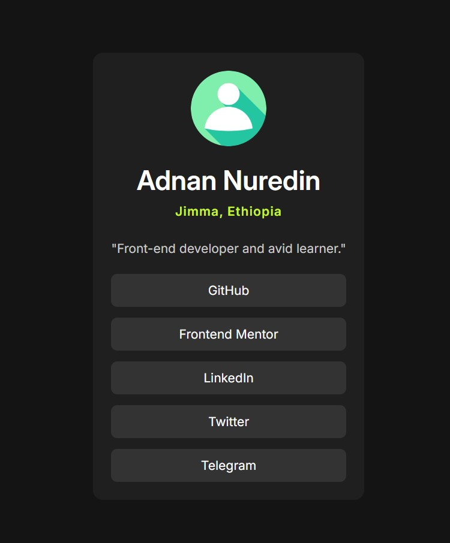

# Frontend Mentor - Social links profile solution

This is a solution to the [Social links profile challenge on Frontend Mentor](https://www.frontendmentor.io/challenges/social-links-profile-UG32l9m6dQ). Frontend Mentor challenges help you improve your coding skills by building realistic projects.

## Table of contents

- [Overview](#overview)
  - [The challenge](#the-challenge)
  - [Screenshot](#screenshot)
  - [Links](#links)
- [My process](#my-process)
  - [Built with](#built-with)
  - [Continued development](#continued-development)
  - [Useful resources](#useful-resources)
- [Author](#author)

## Overview

### The challenge

Users should be able to:

- See hover and focus states for all interactive elements on the page

### Screenshot

### Links

- Solution URL: [Add solution URL here](https://github.com/Adnan7389/social-links-profile)
- Live Site URL: [Add live site URL here](https://adnan7389.github.io/social-links-profile/)

## My process

### Built with

- Semantic HTML5 markup
- CSS custom properties
- Flexbox

### Continued development

I want to learn more styling links and responsiveness

### Useful resources

- (https://www.theodinproject.com) - This is an amazing website which helped me finally understand flex-box. I'd recommend it to anyone still learning this concept.

## Author

<!-- - Website - [Adnan N.](https://www.your-site.com) -->

- Frontend Mentor - [@Adnan7389](https://www.frontendmentor.io/profile/@Adnan7389)
<!-- - Twitter - [@yourusername](https://www.twitter.com/yourusername) -->
